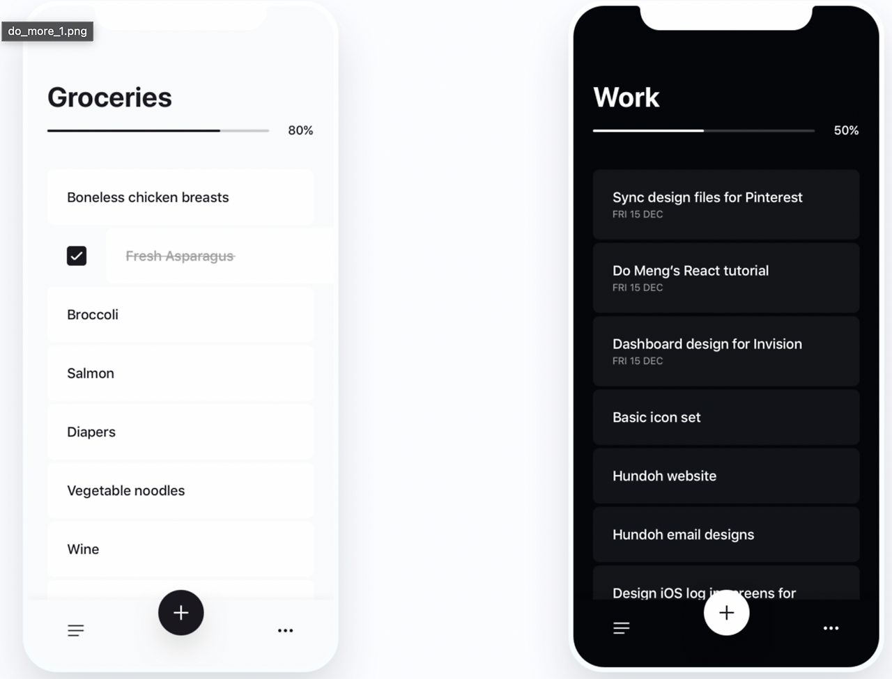
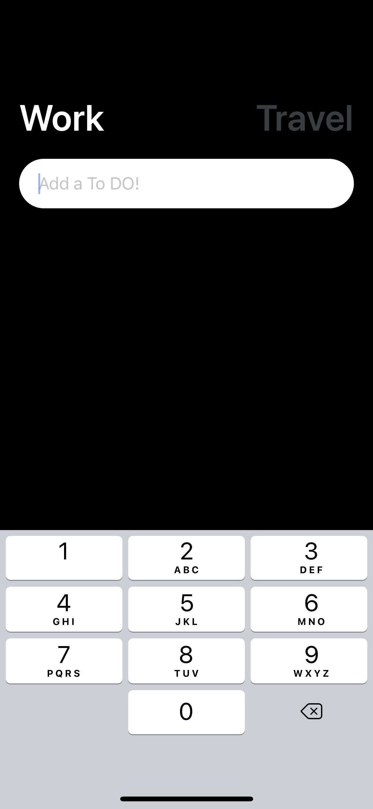

# DayPlan-app

> 일과 여행을 동시에 관리할 수 있는 **React Native 기반 투두 & 트래블 플래너 앱**  
실시간 할 일 관리, 여행 계획 저장, 데이터 영구 저장 기능을 제공합니다.

---

## 🚀 프로젝트 개요
React Native 학습을 기반으로, 실제 서비스처럼 동작하는 모바일 앱을 구현했습니다.  
- `Work` / `Travel` 모드로 구분된 투두 리스트 관리  
- **AsyncStorage** 를 통한 로컬 데이터 영구 저장  
- 간단한 UI/UX를 통한 사용자 친화적 앱  

👉 [실제 앱 데모 (Expo)](https://expo.dev/@hmchung2/worktravel)

---

## ✨ 주요 기능
- ✅ Work / Travel 모드 전환  
- ✍️ 할 일(ToDo) 추가 및 삭제  
- 💾 AsyncStorage 기반 영구 저장 (앱 재실행 시에도 데이터 유지)  
- 📱 직관적인 UI (TouchableOpacity, TextInput 활용)  

---

## 📸 스크린샷
<p align="center">
  
</p>

<p align="center">
  
</p>

---

## 🛠 기술 스택
- **Framework** : React Native, Expo  
- **Language** : JavaScript (ES6)  
- **Library** : @react-native-async-storage/async-storage  
- **Deploy** : Expo, GitHub Pages  

---

## ⚙️ 설치 및 실행
```bash
# Install dependencies
npm install

# Run on Android
expo run:android

# Run on iOS
expo run:ios

# Web build & deploy
npm run deploy
